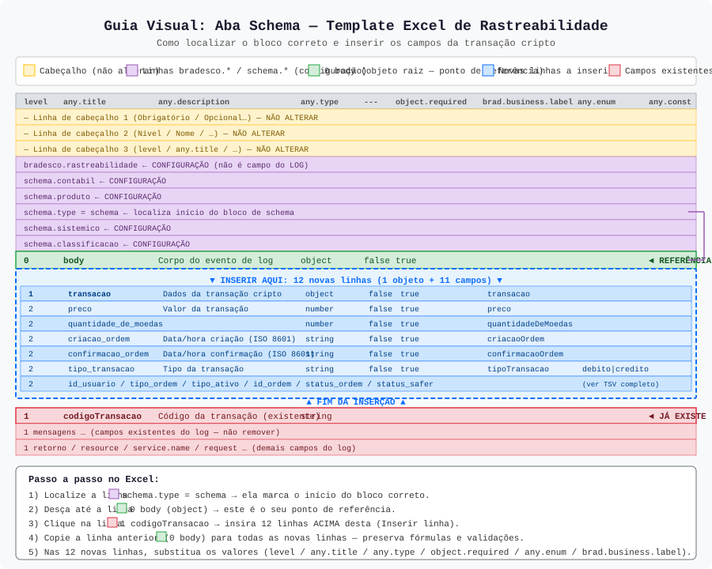
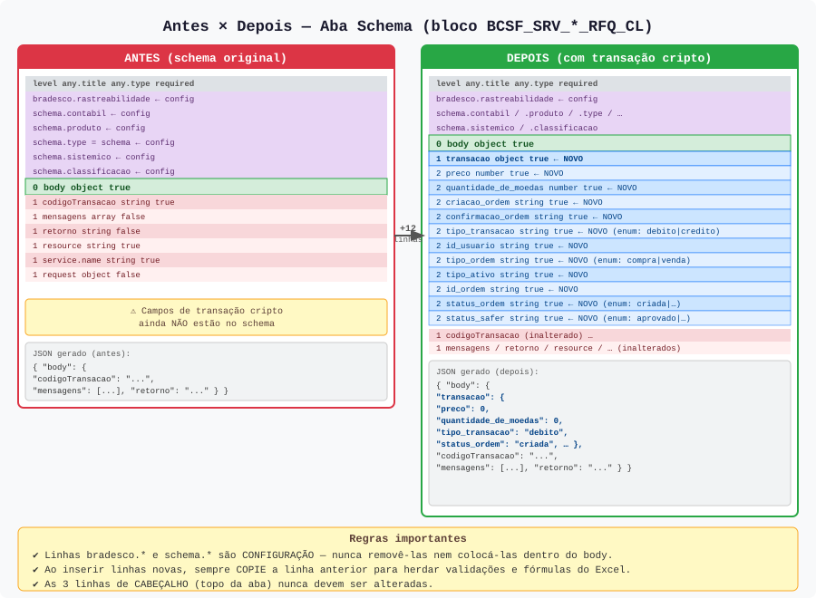

# Guia Visual: Preenchimento da Aba Schema — Template Excel de Rastreabilidade

> **Contexto:** Este guia explica como inserir os 11 campos de uma transação cripto
> (`preco`, `quantidade_de_moedas`, `criacao_ordem`, `confirmacao_ordem`, `tipo_transacao`,
> `id_usuario`, `tipo_ordem`, `tipo_ativo`, `id_ordem`, `status_ordem`, `status_safer`)
> na aba **Schema** do template Excel de rastreabilidade Bradesco,
> respeitando as instruções do próprio arquivo.

---

## Índice

1. [Anatomia da aba Schema](#1-anatomia-da-aba-schema)
2. [Regras obrigatórias do template](#2-regras-obrigatórias-do-template)
3. [Como localizar o bloco correto](#3-como-localizar-o-bloco-correto)
4. [Versão A — Recomendada: `body.transacao`](#4-versão-a--recomendada-bodytransacao)
5. [Versão B — Alternativa: `body.<campo>`](#5-versão-b--alternativa-bodycampo)
6. [Passo a passo no Excel](#6-passo-a-passo-no-excel)
7. [Blocos TSV prontos para colar](#7-blocos-tsv-prontos-para-colar)
8. [Aplicando em BCSF_SRV_CONFIRMACAO_RFQ_CL e BCSF_SRV_STATUS_RFQ_CL](#8-aplicando-em-bcsf_srv_confirmacao_rfq_cl-e-bcsf_srv_status_rfq_cl)

---

## 1. Anatomia da aba Schema

O diagrama abaixo mostra todas as seções da aba (abra o SVG para visualização em alta resolução):

[](diagrama-schema.svg)

| Cor | Significado | Ação |
|-----|-------------|------|
| 🟡 Amarelo | Linhas de **cabeçalho** (3 primeiras linhas) | **Nunca alterar** |
| 🟣 Roxo | Linhas `bradesco.*` e `schema.*` | **Manter** — são configuração do schema, não aparecem no LOG |
| 🟢 Verde | Linha `0 body` | Ponto de **referência** para inserção |
| 🔵 Azul | Novas linhas a inserir | **Inserir aqui**, entre `0 body` e `1 codigoTransacao` |
| 🔴 Vermelho | Linhas existentes do log | **Não remover** |

---

## 2. Regras obrigatórias do template

> Estas instruções estão na própria aba do Excel. Respeite-as rigorosamente.

### Obs 1 — "Ao incluir novas linhas, copie a anterior para manter as fórmulas e validações"

**O que fazer:**

1. Selecione a linha `1 codigoTransacao`.
2. Insira o número de linhas necessárias **acima** (clique direito → Inserir).
3. **Copie a linha `0 body`** (ou outra linha já preenchida) e cole nas novas linhas em branco.
4. Somente então substitua os valores das células (nível, nome, tipo, etc.).

> ⚠ **Não crie linhas em branco e saia digitando diretamente** — você perde validações (dropdowns) e fórmulas.

### Obs 2 — "Não alterar as linhas de Cabeçalho"

As **3 primeiras linhas** da aba contêm os rótulos das colunas. Não edite, não exclua, não mova.

### Obs 3 — "Linhas `bradesco.*` e `schema.*` são configuração e não devem estar presentes no LOG"

Linhas como `bradesco.rastreabilidade`, `schema.contabil`, `schema.produto`, `schema.type`, `schema.sistemico`, `schema.classificacao` existem **por schema** e são processadas pelo gerador como metadados — **não são campos do payload do evento**.  
Mantenha-as intactas; não as insira dentro do bloco `body`.

---

## 3. Como localizar o bloco correto

O arquivo pode conter **dois schemas** na mesma aba (um para `BCSF_SRV_CONFIRMACAO_RFQ_CL` e outro para `BCSF_SRV_STATUS_RFQ_CL`). Cada um tem seu próprio conjunto de linhas `bradesco.*`/`schema.*` e seu próprio `0 body`.

**Como encontrar o bloco certo:**

1. Use **Ctrl+F** e pesquise pelo nome do schema (ex.: `BCSF_SRV_CONFIRMACAO_RFQ_CL`).
2. Desça até encontrar a linha `schema.type` com valor `schema` — ela marca o início do bloco.
3. Continue descendo até achar a linha com `level=0` e `any.title=body`.
4. A linha **imediatamente abaixo** de `0 body` (normalmente `1 codigoTransacao`) é onde você vai inserir.

```
…
schema.type = schema         ← localiza o bloco
schema.sistemico
schema.classificacao
──────────────────────────────
0  body   object             ← REFERÊNCIA — insira abaixo daqui
──────────────────────────────
► INSERIR AQUI ◄
──────────────────────────────
1  codigoTransacao  string   ← linha existente — NÃO remover
1  mensagens        array
…
```

---

## 4. Versão A — Recomendada: `body.transacao`

Cria um **subobjeto `transacao`** dentro de `body`, separando os dados de negócio dos campos de log.

**Estrutura JSON resultante:**

```json
{
  "body": {
    "transacao": {
      "preco": 0,
      "quantidade_de_moedas": 0,
      "criacao_ordem": "2024-01-15T10:30:00Z",
      "confirmacao_ordem": "2024-01-15T10:30:05Z",
      "tipo_transacao": "debito",
      "id_usuario": "usr-12345",
      "tipo_ordem": "compra",
      "tipo_ativo": "BTC",
      "id_ordem": "ord-98765",
      "status_ordem": "confirmada",
      "status_safer": "aprovado"
    },
    "codigoTransacao": "...",
    "mensagens": [],
    "retorno": "..."
  }
}
```

**Linhas a inserir (resumo das colunas principais):**

| level | any.title | any.type | --- | object.required | brad.business.label | any.enum |
|-------|-----------|----------|-----|-----------------|---------------------|----------|
| 1 | transacao | object | false | true | transacao | |
| 2 | preco | number | false | true | preco | |
| 2 | quantidade_de_moedas | number | false | true | quantidadeDeMoedas | |
| 2 | criacao_ordem | string | false | true | criacaoOrdem | |
| 2 | confirmacao_ordem | string | false | true | confirmacaoOrdem | |
| 2 | tipo_transacao | string | false | true | tipoTransacao | debito\|credito |
| 2 | id_usuario | string | false | true | idUsuario | |
| 2 | tipo_ordem | string | false | true | tipoOrdem | compra\|venda |
| 2 | tipo_ativo | string | false | true | tipoAtivo | |
| 2 | id_ordem | string | false | true | idOrdem | |
| 2 | status_ordem | string | false | true | statusOrdem | criada\|confirmada\|cancelada\|falha |
| 2 | status_safer | string | false | true | statusSafer | aprovado\|reprovado\|pendente |

> 📄 **TSV completo** (com todas as colunas do template): [`transacao-body-transacao.tsv`](transacao-body-transacao.tsv)

---

## 5. Versão B — Alternativa: `body.<campo>`

Use esta versão **somente se o consumidor exigir** que os campos fiquem diretamente em `body` (sem subobjeto).

**Estrutura JSON resultante:**

```json
{
  "body": {
    "preco": 0,
    "quantidade_de_moedas": 0,
    "criacao_ordem": "2024-01-15T10:30:00Z",
    "tipo_transacao": "debito",
    "status_ordem": "confirmada",
    "status_safer": "aprovado",
    "codigoTransacao": "...",
    "mensagens": [],
    "retorno": "..."
  }
}
```

**Diferença em relação à Versão A:**

- Não há linha `1 transacao` (object).
- Todos os campos ficam em `level=1` (diretamente em `body`).
- Insira **11 linhas** (em vez de 12) abaixo do `0 body`.

> 📄 **TSV completo** (com todas as colunas do template): [`transacao-body-campos.tsv`](transacao-body-campos.tsv)

---

## 6. Passo a passo no Excel

### Para a Versão A (recomendada — 12 linhas)

```
1. Abra a aba Schema do template Excel.

2. Localize o schema correto:
   Ctrl+F → pesquise "BCSF_SRV_CONFIRMACAO_RFQ_CL" (ou STATUS)
   → desça até encontrar "0  body  object"

3. Selecione a linha inteira de "1  codigoTransacao".

4. Clique direito → Inserir → insira 12 linhas acima.

5. Selecione a linha "0  body" (que ficou logo acima das novas linhas).
   Copie (Ctrl+C).
   Selecione as 12 novas linhas em branco.
   Cole (Ctrl+V) — para herdar validações e fórmulas.

6. Nas 12 novas linhas, substitua os valores conforme a tabela
   da Versão A (ou cole o conteúdo do arquivo transacao-body-transacao.tsv).

   Colunas a preencher:
   ┌──────────────────────┬─────────────────────────────────────────────────────┐
   │ Coluna               │ O que preencher                                     │
   ├──────────────────────┼─────────────────────────────────────────────────────┤
   │ level                │ 1 (transacao) ou 2 (campos filhos)                  │
   │ any.title            │ nome do campo (ex.: preco, tipo_transacao)          │
   │ any.description      │ descrição legível do campo                          │
   │ any.type             │ object / string / number                            │
   │ ---                  │ false (para todos)                                  │
   │ object.required      │ true (para todos)                                   │
   │ brad.business.label  │ nome em camelCase (ex.: tipoTransacao)              │
   │ any.enum             │ valores separados por | (somente para enumerações)  │
   └──────────────────────┴─────────────────────────────────────────────────────┘

   Deixe em branco: string.minLength, string.maxLength, string.pattern,
                    numeric.minimum, numeric.maximum, numeric.multipleOf,
                    array.* e object.min/maxProperties
                    (exceto numeric.minimum=0 para preco e quantidade_de_moedas)

7. Salve o arquivo.
```

### Para a Versão B (alternativa — 11 linhas)

Repita os passos acima, mas insira **11 linhas** (sem a linha do objeto `transacao`) e use `level=1` para todos os campos.

---

## 7. Blocos TSV prontos para colar

### Versão A — `body.transacao` (recomendado)

> Cole este bloco **logo abaixo do `0 body`**, antes do `1 codigoTransacao`.

```tsv
level	any.title	any.description	any.type	---	object.required	brad.business.label	any.enum	any.const	string.minLength	string.maxLength	string.pattern	numeric.minimum	numeric.maximum	numeric.multipleOf	numeric.exclusiveMinimum	numeric.exclusiveMaximum	array.minItems	array.maxItems	array.uniqueItems	array.minContains	array.maxContains	object.minProperties	object.maxProperties
1	transacao	Dados da transação cripto	object	false	true	transacao																	
2	preco	Valor da transação	number	false	true	preco						0											
2	quantidade_de_moedas	Quantidade de moedas negociadas	number	false	true	quantidadeDeMoedas						0											
2	criacao_ordem	Data/hora de criação da ordem (ISO 8601)	string	false	true	criacaoOrdem																	
2	confirmacao_ordem	Data/hora de confirmação da ordem (ISO 8601)	string	false	true	confirmacaoOrdem																	
2	tipo_transacao	Tipo da transação (débito ou crédito)	string	false	true	tipoTransacao	debito|credito																
2	id_usuario	Identificador do usuário	string	false	true	idUsuario																	
2	tipo_ordem	Tipo de ordem (compra ou venda)	string	false	true	tipoOrdem	compra|venda																
2	tipo_ativo	Ativo/moeda negociada (ex.: BTC, ETH)	string	false	true	tipoAtivo																	
2	id_ordem	Identificador único da ordem	string	false	true	idOrdem																	
2	status_ordem	Status da ordem no momento do evento	string	false	true	statusOrdem	criada|confirmada|cancelada|falha																
2	status_safer	Status da ordem no sistema Safer	string	false	true	statusSafer	aprovado|reprovado|pendente																
```

### Versão B — `body.<campo>` (alternativa)

```tsv
level	any.title	any.description	any.type	---	object.required	brad.business.label	any.enum	any.const	string.minLength	string.maxLength	string.pattern	numeric.minimum	numeric.maximum	numeric.multipleOf	numeric.exclusiveMinimum	numeric.exclusiveMaximum	array.minItems	array.maxItems	array.uniqueItems	array.minContains	array.maxContains	object.minProperties	object.maxProperties
1	preco	Valor da transação	number	false	true	preco						0											
1	quantidade_de_moedas	Quantidade de moedas negociadas	number	false	true	quantidadeDeMoedas						0											
1	criacao_ordem	Data/hora de criação da ordem (ISO 8601)	string	false	true	criacaoOrdem																	
1	confirmacao_ordem	Data/hora de confirmação da ordem (ISO 8601)	string	false	true	confirmacaoOrdem																	
1	tipo_transacao	Tipo da transação (débito ou crédito)	string	false	true	tipoTransacao	debito|credito																
1	id_usuario	Identificador do usuário	string	false	true	idUsuario																	
1	tipo_ordem	Tipo de ordem (compra ou venda)	string	false	true	tipoOrdem	compra|venda																
1	tipo_ativo	Ativo/moeda negociada (ex.: BTC, ETH)	string	false	true	tipoAtivo																	
1	id_ordem	Identificador único da ordem	string	false	true	idOrdem																	
1	status_ordem	Status da ordem no momento do evento	string	false	true	statusOrdem	criada|confirmada|cancelada|falha																
1	status_safer	Status da ordem no sistema Safer	string	false	true	statusSafer	aprovado|reprovado|pendente																
```

---

## 8. Aplicando em BCSF_SRV_CONFIRMACAO_RFQ_CL e BCSF_SRV_STATUS_RFQ_CL

Como o arquivo contém **dois schemas** distintos na mesma aba, o procedimento deve ser repetido para cada um separadamente.

### Para `BCSF_SRV_CONFIRMACAO_RFQ_CL`

Este schema captura o evento de **confirmação da RFQ** (quando a ordem é aceita/rejeitada).

1. Pesquise `BCSF_SRV_CONFIRMACAO_RFQ_CL` na aba.
2. Localize o `0 body` **deste bloco** (não confunda com o `body` do outro schema).
3. Insira as linhas conforme a [Versão A](#4-versão-a--recomendada-bodytransacao) ou [B](#5-versão-b--alternativa-bodycampo).

### Para `BCSF_SRV_STATUS_RFQ_CL`

Este schema captura o evento de **atualização de status da RFQ**.

1. Pesquise `BCSF_SRV_STATUS_RFQ_CL` na aba.
2. Localize o `0 body` **deste bloco**.
3. Repita o mesmo procedimento de inserção.

> **Dica:** Se os dois schemas precisam dos mesmos campos de transação, repita a inserção em cada bloco individualmente. Cada bloco tem suas próprias linhas `bradesco.*`/`schema.*` e seu próprio `0 body` — eles são independentes.

### Diagrama antes/depois (ambos os schemas)

[](antes-depois.svg)

---

## Referência rápida: colunas do template

| Coluna | O que é | Preencher? |
|--------|---------|-----------|
| `level` | Nível de aninhamento (0=raiz, 1=filho de body, 2=neto) | ✅ Sempre |
| `any.title` | Nome técnico do campo (snake_case) | ✅ Sempre |
| `any.description` | Descrição legível do campo | ✅ Recomendado |
| `any.type` | Tipo JSON (`object`, `string`, `number`, `array`, `boolean`) | ✅ Sempre |
| `---` | Lista (dropdown) — use `false` para campo simples | ✅ Sempre |
| `object.required` | Se o campo é obrigatório | ✅ Sempre |
| `brad.business.label` | Rótulo de negócio em camelCase | ✅ Recomendado |
| `any.enum` | Valores permitidos separados por `\|` | ✅ Se enum |
| `any.const` | Valor fixo (constante) | Só se necessário |
| `string.minLength` / `string.maxLength` | Tamanho mínimo/máximo de string | Só se necessário |
| `string.pattern` | Regex de validação | Só se necessário |
| `numeric.minimum` / `numeric.maximum` | Valor mínimo/máximo numérico | Para `preco` e `quantidade_de_moedas`: mínimo = `0` |
| `array.*` | Configurações de array | Só para campos `any.type=array` |
| `object.minProperties` / `object.maxProperties` | Qtd. mínima/máxima de propriedades | Raramente necessário |
