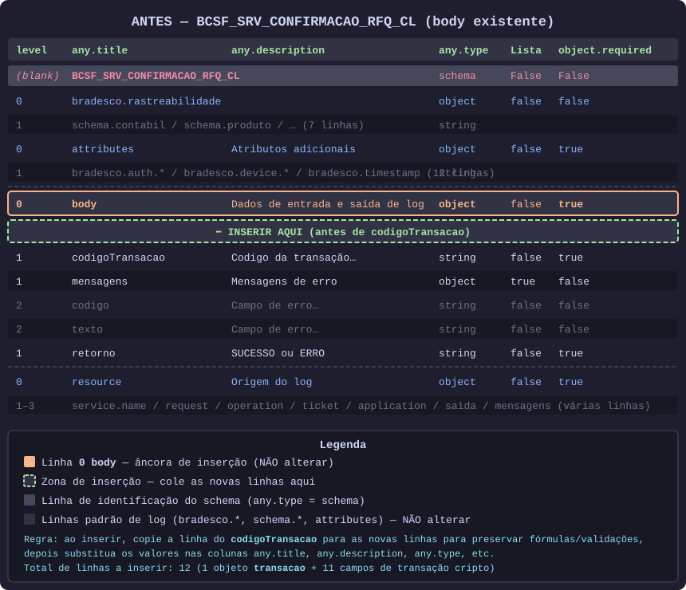
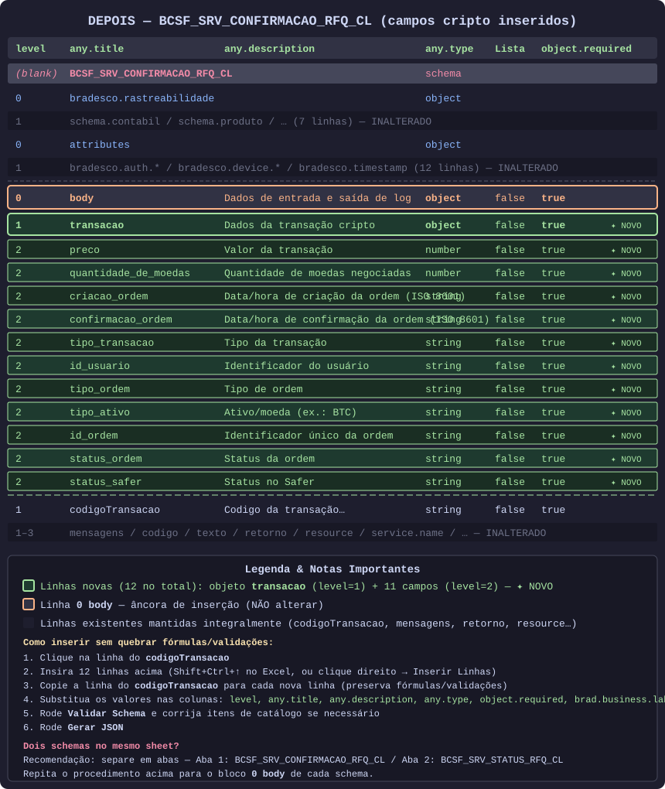
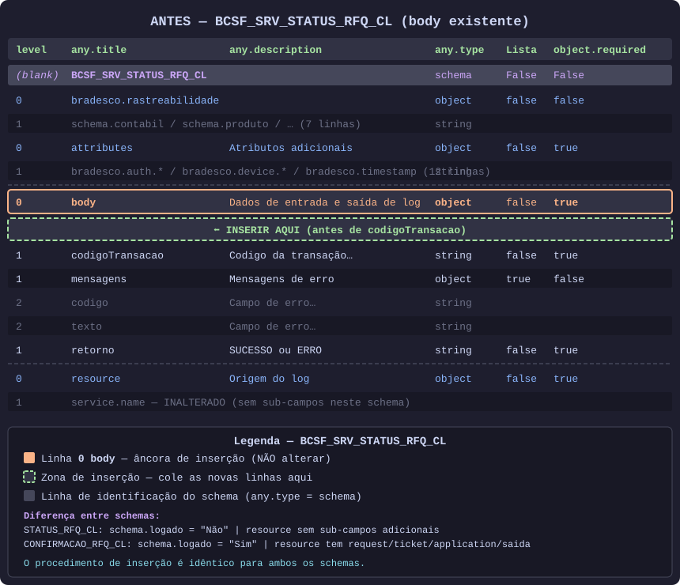
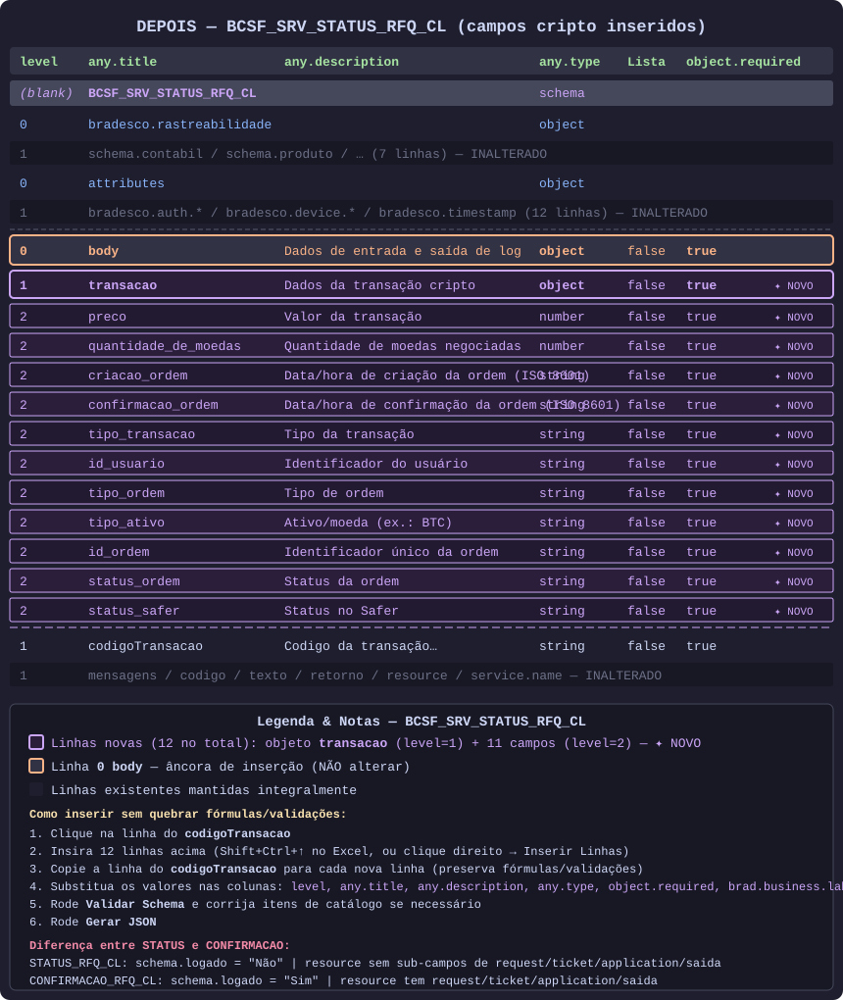

# Guia Visual — Inserção de Campos de Transação Cripto nos Schemas de Log

Este guia mostra **exatamente onde e como** inserir os campos de transação cripto no template Excel,
para os dois schemas:
- `BCSF_SRV_CONFIRMACAO_RFQ_CL` — Confirmação de RFQ para Negociação Cripto
- `BCSF_SRV_STATUS_RFQ_CL` — Retorno Status Transação

---

## Índice

1. [Estrutura do Template Excel](#1-estrutura-do-template-excel)
2. [Regras Fundamentais](#2-regras-fundamentais)
3. [Passo a Passo — Onde Inserir](#3-passo-a-passo--onde-inserir)
4. [Diagramas Antes/Depois](#4-diagramas-antesdepois)
5. [Colunas Essenciais a Preencher](#5-colunas-essenciais-a-preencher)
6. [Bloco TSV Pronto para Colar](#6-bloco-tsv-pronto-para-colar)
7. [Como Lidar com Dois Schemas no Mesmo Sheet](#7-como-lidar-com-dois-schemas-no-mesmo-sheet)
8. [JSON Resultante Esperado](#8-json-resultante-esperado)

---

## 1. Estrutura do Template Excel

O template usa um formato de "linhas de schema" com cabeçalho fixo de **3 linhas**:

| Linha | Conteúdo |
|-------|----------|
| 1 | Rótulos de obrigatoriedade (`Obrigatório / Opcional`) |
| 2 | Nomes amigáveis (`Nível`, `Nome`, `Descrição`, `Tipo`, ...) |
| 3 | Nomes de coluna técnicos (`level`, `any.title`, `any.description`, `any.type`, ...) |

**Essas 3 linhas de cabeçalho nunca devem ser alteradas.**

Cada schema no arquivo começa com uma **linha identificadora** onde `any.type = schema`:

```
(blank)  BCSF_SRV_CONFIRMACAO_RFQ_CL  CONFIRMACAODERFQPARANEGOCIACAOCRIPTO  schema  False  False
```

A partir daí, as linhas seguem a hierarquia de objetos via coluna `level` (0, 1, 2, 3...).

---

## 2. Regras Fundamentais

> ⚠️ **NUNCA altere:**
> - As 3 linhas de cabeçalho
> - As linhas `bradesco.*` e `schema.*` (configuração de rastreabilidade)
> - A linha `0 body` em si (apenas insira linhas abaixo dela)
> - As linhas `0 attributes`, `0 resource`, `0 bradesco.rastreabilidade`

> ✅ **SEMPRE:**
> - Ao inserir novas linhas no Excel, **copie a linha do `codigoTransacao`** para as novas linhas — isso preserva fórmulas e validações de célula
> - Depois substitua os valores nas colunas relevantes

---

## 3. Passo a Passo — Onde Inserir

### 3.1 Localizar o schema correto

O arquivo pode conter múltiplos schemas. Cada bloco começa com a linha onde `any.type = schema`:

```
(blank)  BCSF_SRV_CONFIRMACAO_RFQ_CL  ...  schema  False  False
(blank)  BCSF_SRV_STATUS_RFQ_CL       ...  schema  False  False
```

### 3.2 Localizar o `0 body` do schema

Dentro do bloco do schema escolhido, procure a linha com `level=0` e `any.title=body`:

```
0   body   Dados de entrada e saída de log   object   false   true
```

### 3.3 Inserir as novas linhas

As novas linhas vão **entre `0 body` e `1 codigoTransacao`**:

```
0   body             ← âncora (NÃO alterar)
                     ← ✦ INSERIR AQUI (12 novas linhas)
1   codigoTransacao  ← linha existente (descer)
1   mensagens
...
```

**No Excel:**
1. Clique na célula da linha `1 codigoTransacao`
2. Selecione a linha inteira (clique no número da linha)
3. Clique com botão direito → **Inserir** → repita até ter 12 linhas novas acima
4. Copie a linha do `codigoTransacao` para cada uma das 12 novas linhas
5. Edite os valores conforme o bloco TSV abaixo

---

## 4. Diagramas Antes/Depois

### BCSF_SRV_CONFIRMACAO_RFQ_CL

**Antes** (estrutura original do `body`):



**Depois** (com campos de transação cripto inseridos):



---

### BCSF_SRV_STATUS_RFQ_CL

**Antes** (estrutura original do `body`):



**Depois** (com campos de transação cripto inseridos):



---

## 5. Colunas Essenciais a Preencher

| Coluna | Descrição | Obrigatório? |
|--------|-----------|:---:|
| `level` | Nível hierárquico do campo (1 = filho de body, 2 = filho de transacao) | ✅ |
| `any.title` | Nome técnico do campo (snake_case recomendado) | ✅ |
| `any.description` | Descrição do campo | ✅ |
| `any.type` | Tipo do dado: `object`, `string`, `number`, `boolean`, `array` | ✅ |
| `---` (Lista) | `true` se for array, `false` caso contrário | ✅ |
| `object.required` | `true` se o campo é obrigatório no objeto pai | ✅ |
| `brad.business.label` | Nome de negócio (camelCase, sem espaços) | ✅ |
| `any.enum` | Valores permitidos separados por `\|` (ex.: `compra\|venda`) | Opcional |
| `any.const` | Valor fixo único (ex.: `BTC` se sempre for BTC) | Opcional |
| `string.minLength` | Tamanho mínimo para strings | Opcional |
| `string.maxLength` | Tamanho máximo para strings | Opcional |
| `string.pattern` | Regex de validação (ex.: `^\d{4}-\d{2}-\d{2}T` para datas ISO) | Opcional |
| `numeric.minimum` | Valor mínimo para números | Opcional |
| `numeric.maximum` | Valor máximo para números | Opcional |

---

## 6. Bloco TSV Pronto para Colar

> O bloco abaixo é **idêntico para ambos os schemas** (`BCSF_SRV_CONFIRMACAO_RFQ_CL` e `BCSF_SRV_STATUS_RFQ_CL`).
> Cole logo abaixo da linha `0 body` e antes do `1 codigoTransacao` em cada schema.

Os arquivos TSV prontos estão disponíveis para download:
- [`tsv-confirmacao.tsv`](tsv-confirmacao.tsv) — para BCSF_SRV_CONFIRMACAO_RFQ_CL
- [`tsv-status.tsv`](tsv-status.tsv) — para BCSF_SRV_STATUS_RFQ_CL

### Conteúdo do bloco (24 colunas — mesma ordem do template):

Veja os arquivos [`tsv-confirmacao.tsv`](tsv-confirmacao.tsv) e [`tsv-status.tsv`](tsv-status.tsv) para o bloco completo com as 24 colunas em tabs corretos.

Formato resumido (as primeiras 12 colunas relevantes):

```
level  any.title             any.description                            any.type  ---    object.required  brad.business.label  any.enum                         any.const  minLen  maxLen  pattern
1      transacao             Dados da transação cripto                  object    false  true             transacao
2      preco                 Valor da transação                         number    false  true             preco                                                             0(min)
2      quantidade_de_moedas  Quantidade de moedas negociadas            number    false  true             quantidadeDeMoedas                                                0(min)
2      criacao_ordem         Data/hora de criação da ordem (ISO 8601)   string    false  true             criacaoOrdem                                                      1       ^\d{4}-\d{2}-\d{2}T
2      confirmacao_ordem     Data/hora de confirmação da ordem (ISO 8601)  string    false  true             confirmacaoOrdem                                               1       ^\d{4}-\d{2}-\d{2}T
2      tipo_transacao        Tipo da transação                          string    false  true             tipoTransacao        debito|credito
2      id_usuario            Identificador do usuário                   string    false  true             idUsuario                                                         1
2      tipo_ordem            Tipo de ordem                              string    false  true             tipoOrdem            compra|venda
2      tipo_ativo            Ativo/moeda (ex.: BTC)                     string    false  true             tipoAtivo                                                         1
2      id_ordem              Identificador único da ordem               string    false  true             idOrdem                                                           1
2      status_ordem          Status da ordem                            string    false  true             statusOrdem          criada|confirmada|cancelada|falha
2      status_safer          Status no Safer                            string    false  true             statusSafer          aprovado|reprovado|pendente
```

### Descrição de cada campo

| Campo | Tipo | any.enum / Notas |
|-------|------|-----------------|
| `transacao` | `object` | Subobjeto raiz dos dados de transação cripto (level=1) |
| `preco` | `number` | Valor em reais (ou unidade base); mínimo = 0 |
| `quantidade_de_moedas` | `number` | Quantidade de moedas negociadas; mínimo = 0 |
| `criacao_ordem` | `string` | ISO 8601, ex.: `2024-11-15T10:30:00Z`; regex `^\d{4}-\d{2}-\d{2}T` |
| `confirmacao_ordem` | `string` | ISO 8601, ex.: `2024-11-15T10:31:05Z`; regex `^\d{4}-\d{2}-\d{2}T` |
| `tipo_transacao` | `string` | `debito\|credito` |
| `id_usuario` | `string` | CPF ou identificador do usuário |
| `tipo_ordem` | `string` | `compra\|venda` |
| `tipo_ativo` | `string` | Símbolo do ativo (ex.: BTC). Use any.const = BTC se for sempre BTC |
| `id_ordem` | `string` | UUID ou identificador único da ordem |
| `status_ordem` | `string` | `criada\|confirmada\|cancelada\|falha` |
| `status_safer` | `string` | `aprovado\|reprovado\|pendente` |

> **Nota sobre `tipo_ativo`:** Se o ativo for sempre `BTC`, substitua o `any.enum` por `any.const = BTC` (coluna 9, deixando a coluna 8 vazia).

> **Nota sobre datas:** Se o regex `^\d{4}-\d{2}-\d{2}T` causar problemas na validação do Excel, deixe a coluna `string.pattern` em branco.

> **Nota sobre números negativos:** Se `preco` ou `quantidade_de_moedas` puderem ser negativos, deixe a coluna `numeric.minimum` em branco.

---

## 7. Como Lidar com Dois Schemas no Mesmo Sheet

O arquivo TSV fornecido contém **dois schemas** no mesmo arquivo:

```
(blank)  BCSF_SRV_CONFIRMACAO_RFQ_CL  ...  schema  False  False
... (linhas do primeiro schema) ...
(blank)  BCSF_SRV_STATUS_RFQ_CL       ...  schema  False  False
... (linhas do segundo schema) ...
```

### Opção A (recomendada): Separar em abas

| Aba | Schema |
|-----|--------|
| Aba 1 | `BCSF_SRV_CONFIRMACAO_RFQ_CL` |
| Aba 2 | `BCSF_SRV_STATUS_RFQ_CL` |

- Cole o bloco TSV no `0 body` de **cada aba** separadamente
- Rode **Validar Schema** e **Gerar JSON** em cada aba individualmente
- Evita conflitos de fórmulas e validações entre schemas

### Opção B: Manter no mesmo sheet

- Identifique o bloco de cada schema pela linha `any.type = schema`
- Insira as 12 novas linhas no `0 body` do **primeiro schema** (`CONFIRMACAO`)
- Insira outras 12 novas linhas no `0 body` do **segundo schema** (`STATUS`)
- Tenha atenção ao **índice de linha correto** de cada schema — não misture os blocos

---

## 8. JSON Resultante Esperado

Após inserir os campos e rodar **Gerar JSON**, o campo `body` de ambos os schemas deve produzir:

```json
{
  "body": {
    "transacao": {
      "preco": 0,
      "quantidade_de_moedas": 0,
      "criacao_ordem": "2024-11-15T10:30:00Z",
      "confirmacao_ordem": "2024-11-15T10:31:05Z",
      "tipo_transacao": "debito",
      "id_usuario": "12345678901",
      "tipo_ordem": "compra",
      "tipo_ativo": "BTC",
      "id_ordem": "550e8400-e29b-41d4-a716-446655440000",
      "status_ordem": "confirmada",
      "status_safer": "aprovado"
    },
    "codigoTransacao": "BCSF_SRV_CONFIRMACAO_RFQ_CL",
    "mensagens": {
      "codigo": "",
      "texto": ""
    },
    "retorno": "SUCESSO"
  }
}
```

> Os campos `codigoTransacao`, `mensagens` e `retorno` permanecem inalterados, logo após o subobjeto `transacao`.

---

## Checklist Final

- [ ] Cabeçalho (3 linhas) não foi alterado
- [ ] Linha identificadora do schema (`any.type=schema`) não foi alterada
- [ ] Linhas `bradesco.*`, `schema.*`, `attributes`, `resource` não foram alteradas
- [ ] Linha `0 body` não foi alterada
- [ ] 12 novas linhas inseridas **entre `0 body` e `1 codigoTransacao`**
- [ ] Cada nova linha foi copiada da linha `codigoTransacao` antes de editar
- [ ] Colunas `level`, `any.title`, `any.description`, `any.type`, `---`, `object.required`, `brad.business.label` preenchidas
- [ ] Colunas `any.enum` preenchidas para campos com valores fixos
- [ ] **Validar Schema** executado sem erros
- [ ] **Gerar JSON** executado com sucesso
- [ ] (Se dois schemas) Procedimento repetido para o segundo schema

---

*Gerado automaticamente como guia de referência para inserção de campos de transação cripto nos schemas de log Bradesco.*
