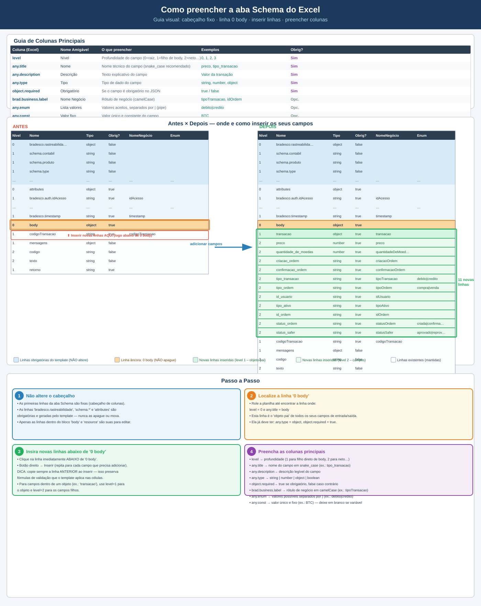

# Como preencher a aba Schema do Excel — Guia Visual

> **Objetivo:** mostrar, de forma visual, onde e como adicionar novos campos  
> ao arquivo Excel de definição de Schema usado na plataforma de logs Bradesco.

---

## Infográfico (abre em tamanho completo)



---

## Estrutura da aba Schema

A aba **Schema** é uma planilha Excel dividida em **blocos de linhas** com hierarquia  
definida pelo valor da coluna `level` (Nível):

| Bloco | `level` | Descrição |
|-------|---------|-----------|
| `bradesco.rastreabilidade` | 0 | Raiz das linhas obrigatórias do template |
| `schema.*` | 1 | Metadados do schema (produto, tipo, classificação…) |
| `attributes` | 0 | Atributos técnicos (auth, device, timestamp…) |
| **`body`** | **0** | **Objeto principal — seus campos ficam aqui** |
| `resource` | 0 | Dados de origem do log (service.name, request…) |

---

## Colunas principais a preencher

| Coluna (Excel) | Nome Amigável | O que preencher | Obrigatória? |
|----------------|---------------|-----------------|:---:|
| `level` | Nível | Profundidade do campo (0 = raiz, 1 = filho, 2 = neto…) | ✅ |
| `any.title` | Nome | Nome técnico do campo (`snake_case` recomendado) | ✅ |
| `any.description` | Descrição | Texto explicativo do campo | ✅ |
| `any.type` | Tipo | `string`, `number`, `object`, `boolean` | ✅ |
| `object.required` | Obrigatório | `true` se o campo for obrigatório no JSON | ✅ |
| `brad.business.label` | Nome Negócio | Rótulo de negócio em `camelCase` | Opcional |
| `any.enum` | Lista de valores | Valores aceitos separados por pipe (`|`) | Opcional |
| `any.const` | Valor fixo | Valor único e constante (ex.: `BTC`) | Opcional |

---

## Passo a passo

### ① Não altere o cabeçalho

- As **primeiras linhas** da aba (cabeçalho com nomes das colunas) são **fixas**.
- As linhas `bradesco.rastreabilidade`, `schema.*` e `attributes` são geradas  
  pelo template — **nunca as apague ou mova**.
- Somente o bloco `body` (e `resource`) são suas para editar.

---

### ② Localize a linha `0 body`

Procure a linha onde:

```
level = 0   |   any.title = body   |   any.type = object   |   object.required = true
```

Essa linha é o **objeto pai** de todos os seus campos de entrada/saída do log.

---

### ③ Insira novas linhas abaixo de `0 body`

1. Clique na **linha imediatamente abaixo** de `0 body`.
2. Botão direito → **Inserir linha** (repita até ter linhas suficientes).
3. **Dica importante:** copie sempre a linha **anterior** ao inserir — isso preserva  
   as fórmulas de validação que o template aplica nas células.

> Se seus campos fazem parte de um sub-objeto (ex.: `transacao`):  
> use `level = 1` para o objeto pai e `level = 2` para os campos filhos.

---

### ④ Preencha as colunas

Use o modelo TSV abaixo para copiar e colar diretamente no Excel  
(as colunas seguem a ordem da planilha):

```
level	any.title	any.description	any.type	Lista	object.required	brad.business.label	any.enum	any.const
1	transacao	Dados da transação cripto	object	false	true	transacao		
2	preco	Valor da transação.	number	false	true	preco		
2	quantidade_de_moedas	Quantidade de moedas negociadas.	number	false	true	quantidadeDeMoedas		
2	criacao_ordem	Data/hora de criação da ordem (ISO 8601).	string	false	true	criacaoOrdem		
2	confirmacao_ordem	Data/hora de confirmação da ordem (ISO 8601).	string	false	true	confirmacaoOrdem		
2	tipo_transacao	Tipo da transação: debito ou credito.	string	false	true	tipoTransacao	debito|credito	
2	id_usuario	Identificador do usuário.	string	false	true	idUsuario		
2	tipo_ordem	Tipo de ordem: compra ou venda.	string	false	true	tipoOrdem	compra|venda	
2	tipo_ativo	Símbolo do ativo/moeda (ex.: BTC).	string	false	true	tipoAtivo		
2	id_ordem	Identificador único da ordem.	string	false	true	idOrdem		
2	status_ordem	Status da operação.	string	false	true	statusOrdem	criada|confirmada|cancelada|falha	
2	status_safer	Status da operação no Safer.	string	false	true	statusSafer	aprovado|reprovado|pendente	
```

---

## Antes × Depois — resumo visual em texto

### Antes

```
... linhas obrigatórias (bradesco.*, schema.*, attributes) ...
─────────────────────────────────────────────────────────────
level=0 | body | Dados de entrada e saída | object | true
level=1 | codigoTransacao | Codigo da transação | string | true
level=1 | mensagens       | Mensagens de erro   | object | false
...
```

### Depois (inserir logo abaixo de `0 body`)

```
... linhas obrigatórias (bradesco.*, schema.*, attributes) ...
─────────────────────────────────────────────────────────────
level=0 | body       | Dados de entrada e saída     | object | true   ← âncora
─────────────────────────────────────────────────────────────
level=1 | transacao  | Dados da transação cripto     | object | true   ← NOVO
level=2 | preco      | Valor da transação.           | number | true   ← NOVO
level=2 | quantidade_de_moedas | Qtd. moedas       | number | true   ← NOVO
level=2 | criacao_ordem        | Data/hora criação | string | true   ← NOVO
level=2 | confirmacao_ordem    | Data/hora confirm.| string | true   ← NOVO
level=2 | tipo_transacao       | debito ou credito | string | true   ← NOVO  (enum: debito|credito)
level=2 | id_usuario           | Id do usuário     | string | true   ← NOVO
level=2 | tipo_ordem           | compra ou venda   | string | true   ← NOVO  (enum: compra|venda)
level=2 | tipo_ativo           | Símbolo do ativo  | string | true   ← NOVO
level=2 | id_ordem             | Id único da ordem | string | true   ← NOVO
level=2 | status_ordem         | Status operação   | string | true   ← NOVO  (enum: criada|confirmada|cancelada|falha)
level=2 | status_safer         | Status no Safer   | string | true   ← NOVO  (enum: aprovado|reprovado|pendente)
─────────────────────────────────────────────────────────────
level=1 | codigoTransacao | Codigo da transação | string | true   ← mantido
level=1 | mensagens       | Mensagens de erro   | object | false  ← mantido
...
```

---

## Checklist final

- [ ] Cabeçalho da planilha **não** foi alterado
- [ ] Linhas `bradesco.*`, `schema.*` e `attributes` **não** foram removidas
- [ ] Linha `0 body` foi mantida como ponto de ancoragem
- [ ] Novas linhas foram inseridas logo abaixo de `0 body`
- [ ] Cada nova linha tem `level`, `any.title`, `any.type` e `object.required` preenchidos
- [ ] Campos com valores limitados têm `any.enum` preenchido (ex.: `debito|credito`)
- [ ] Campos com valor único têm `any.const` preenchido (ex.: `BTC`)
- [ ] Botão **Validar Schema** executado sem erros
- [ ] Botão **Gerar JSON** executado com sucesso
